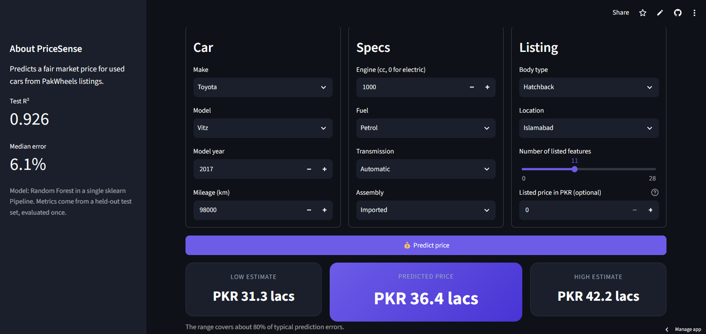
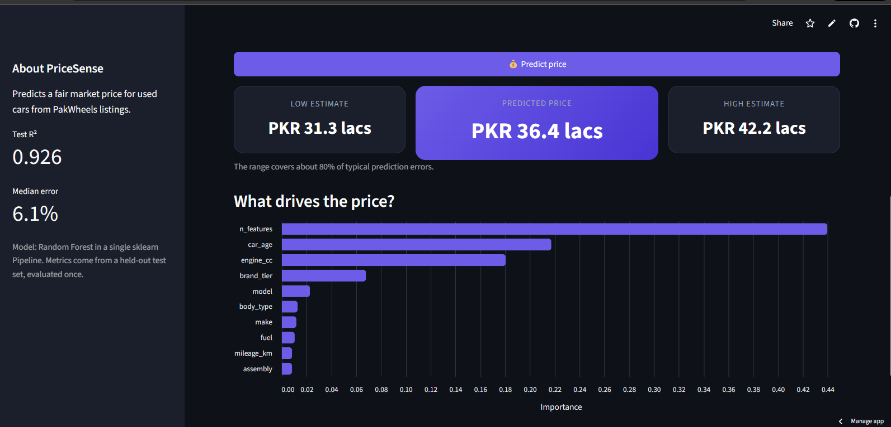
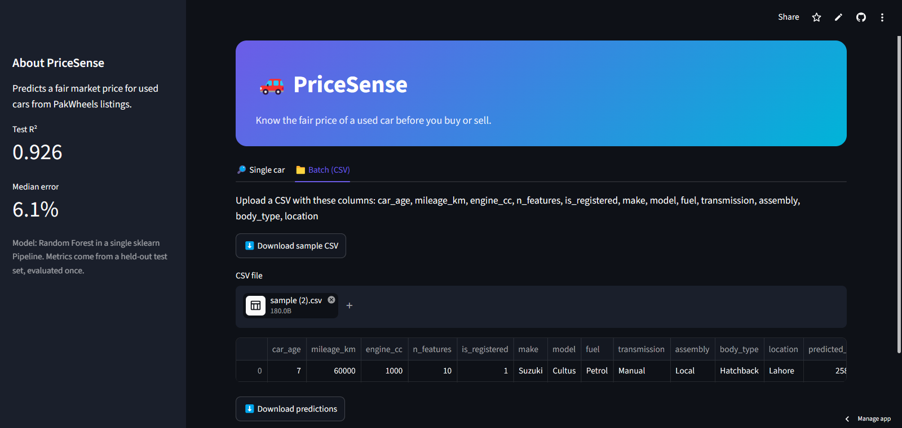

# PriceSense: Used Car Price Predictor

Predicts a fair market price for used cars in Pakistan from make, model, year, mileage, engine and location.

**Live demo:** https://pricesense-kcztmnpnzzbgfqsheqyhzj.streamlit.app/




## Problem
Buyers and sellers on car marketplaces rarely know the fair price of a used car. PriceSense predicts a price with a likely range and flags whether a listed price is a good deal.

## Dataset
PakWheels used-car listings (Kaggle), 61,919 rows and 15 columns. After cleaning: 61,024 rows.

## Approach
1. **Cleaning** (`src/cleaning.py`): price text (lacs/crore) converted to PKR; dropped 853 "Call for price" rows, 8 duplicate ads and 34 rows with years before 1970; impossible mileage and engine values set to missing; electric cars set to 0 cc.
2. **EDA** (`notebooks/02_eda_vscode.ipynb`): 8 insights with charts, plus an IQR outlier check on log price.
3. **Features** (`src/features.py`): car age, mileage per year, brand tier (from median price per make), number of listed features, make/model split.
4. **Modelling**: one sklearn Pipeline (feature step, imputation, scaling, one-hot encoding with rare and unseen categories grouped, model). Target is log(price). Preprocessing is fitted only on training data, including inside cross-validation.
5. **Evaluation**: 3 models compared with 3-fold cross-validation on the training set; the test set was evaluated once, after selection.

## Results

Cross-validation (training set, log scale):

| Model | MAE | RMSE | R2 |
|---|---|---|---|
| Baseline (median) | 0.671 | 0.874 | -0.001 |
| Ridge | 0.133 | 0.201 | 0.947 |
| **Random Forest** | **0.101** | **0.164** | **0.965** |
| Gradient Boosting | 0.120 | 0.177 | 0.959 |

Final test set (PKR, evaluated once):

| Metric | Baseline (median) | Random Forest |
|---|---|---|
| MAE | 2,470,632 | 376,168 |
| RMSE | 6,007,510 | 1,591,640 |
| R2 | -0.049 | 0.926 |
| Median abs % error | 49.5% | 6.1% |

Top features: n_features (0.44), car_age (0.22), engine_cc (0.18), brand_tier (0.07).



## App features
- Predicted price with a likely range (about 80% interval from cross-validated residuals)
- "Is this a good deal?" check against a listed price
- Feature importance chart
- Batch prediction from an uploaded CSV
- Unseen categories do not crash the app
- Model, fuel, body type, transmission and assembly defaults auto-fill from the chosen model



## How to run
```bash
git clone https://github.com/ma5029blp-wq/pricesense.git
cd pricesense
python -m venv venv
venv\Scripts\activate        # Mac/Linux: source venv/bin/activate
pip install -r requirements.txt
streamlit run app/app.py
```
To retrain: `python src/cleaning.py`, then run the modelling notebook and `python src/make_options.py`.

## Limitations
- Location is a mix of cities, provinces and "Unregistered", not clean city data.
- `n_features` is the strongest feature but partly proxies for newer, higher-trim cars; users must enter it themselves.
- "Unregistered" cars are priced higher in the data (likely new imports), so `is_registered` is not a discount signal.
- Rare models and unusual combinations (for example an APV with an SUV body type) give less reliable predictions.
- Brand tiers were computed from medians over the full dataset, including test rows; the effect is small, but a stricter version would use training rows only.
- Dropdown defaults are the most common values per model, not guarantees.
- Prices are asking prices from listings, not final sale prices.
- Random Forest model file is about 60 MB.